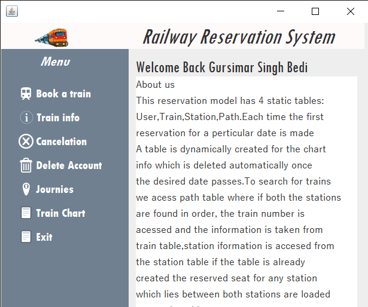
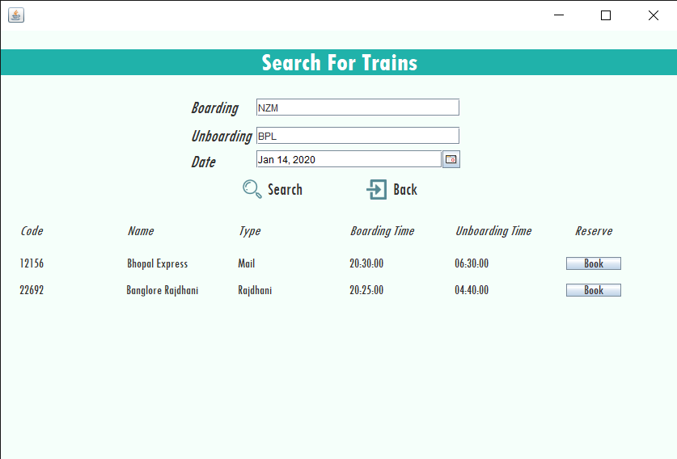
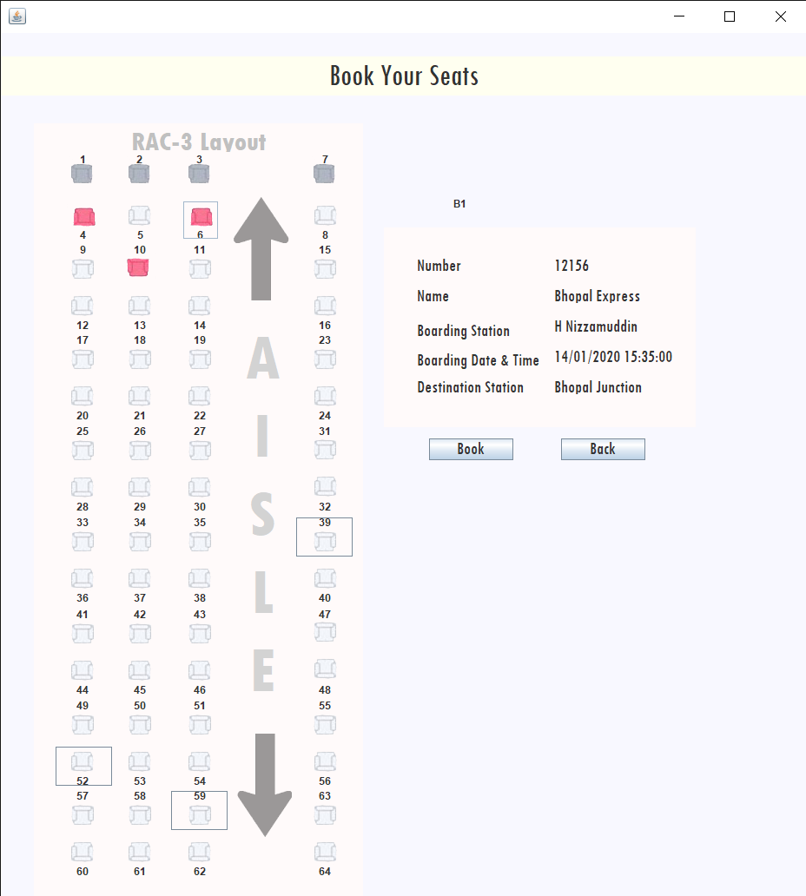

# Railway Reservation Simulator model With Seat Booking GUI
> A simple Java Application which deals with railway reservation with emphesis on giving the user the freedom to choose any available seat rather than a random seat being alloted to them

---

### Table Of Contents
- [Description](#description)
- [Constraints](#constraints)
- [How To Use](#how-to-use)
- [Author Info](#author-info)

---

## Description

The Fourth largest railway netork in the world, The Indian railway runs more than 20,000 passenger trains daily, on both long-distance and suburban routes, from 7,349 stations across India. This java based project simply allows a user to simulate the booking process with the added functionality of being specific about the seats( and coach) that the user desires. The user can also view his previous journies, cancel ticket, view the train chart, find a trains information, check pnr and can obviously create new accounts or delete previous accounts. All trains added have their original working days, number of coaches and seats.

### Technologies

- JAVA
- MySQL

---

## Constraints
- The database has only few trains added to it.
- User has to search for stations using the station code. 
- No option for RAC/ Waiting List currently
- The user can book atmost 10 days in advance.

---

## How To Use
 ### Database
 The code for the database is in a notepad file, to be copied to MySQL.This reservation simulation model has 4 static tables: Users,Train,Station,Path. Although each time the first reservation for a perticular date is made a table is dynamically created for the chart information.
 ### Login
 Default login username=user password=pass or one can simply create a new account.

---

## Author Info
- Linkedin - [Gursimar Singh Bedi](https://www.linkedin.com/in/gursimar-singh-bedi-31439a170)

[Back to the top](#railway-reservation-simulator-model-with-seat-booking-gui)
